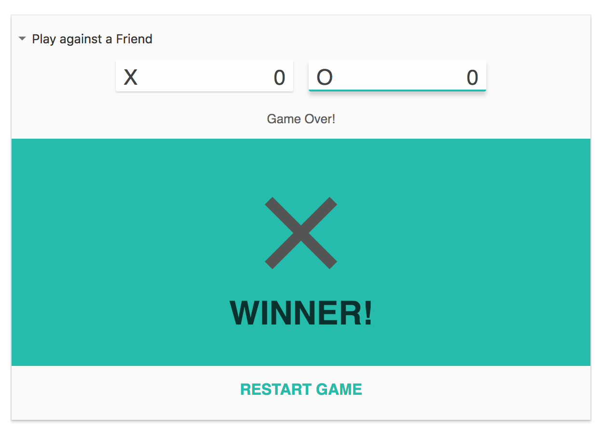

<p align="center">
  <a href="https://www.google.com/search?q=tic+tac+toe" rel="noopener" target="_blank"></a></p>
</p>

<h1 align="center">Tic Tac Toe</h1>

<div align="center">

Clone of [Google's version](https://github.concur.com/nui/nui-docs/blob/master/README.md) of tic tac toe game in react.

## Setup Instructions

The game was built using the standard create-react-app

</div>

1.  Install all the dependencies

    ```bash
    $ npm i
    ```

2.  Then run the game


    ```bash
    $ npm start
    ```
